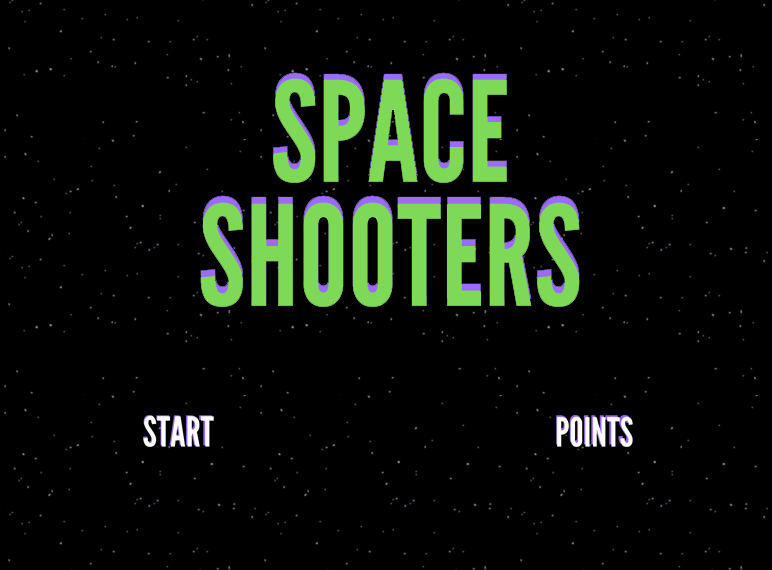

<h1 align="center">
  
</h1>

## 🧪 Technologies

This project was developed using the following technologies:

- [GameMaker Studio 2](https://www.yoyogames.com/en)

## 🔥 Preview


## 🚀 Getting started

Clone the project and access the folder

```bash
$ git clone https://github.com/C0bal/gamemaker-space-shooters && cd gamemaker-space-shooters
```

```bash
# Extract
$ extract Space Shooter.zip

# Run
$ run Space Shooter.exe
```

## 💻 Project

My third game made in GameMaker Studio 2 using the GM language, this game is an alternative version of original Space Invaders.

## 📝 License

This project is licensed under the MIT License. See the [LICENSE](LICENSE.md) file for details.

---

Projected by Rafael Menegon
